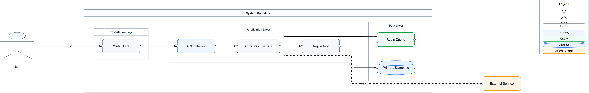
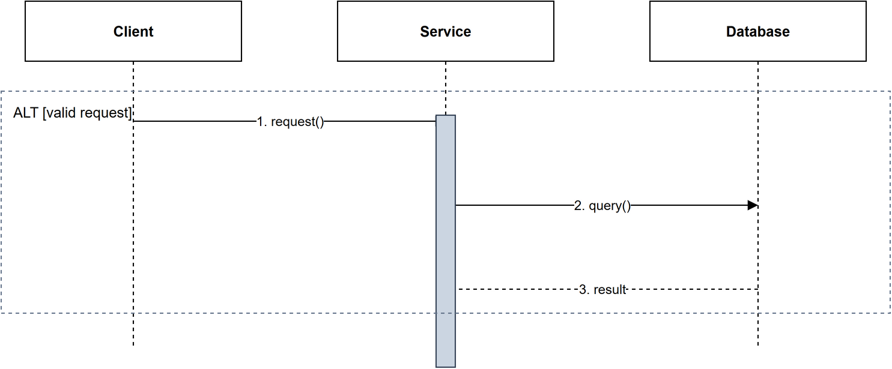
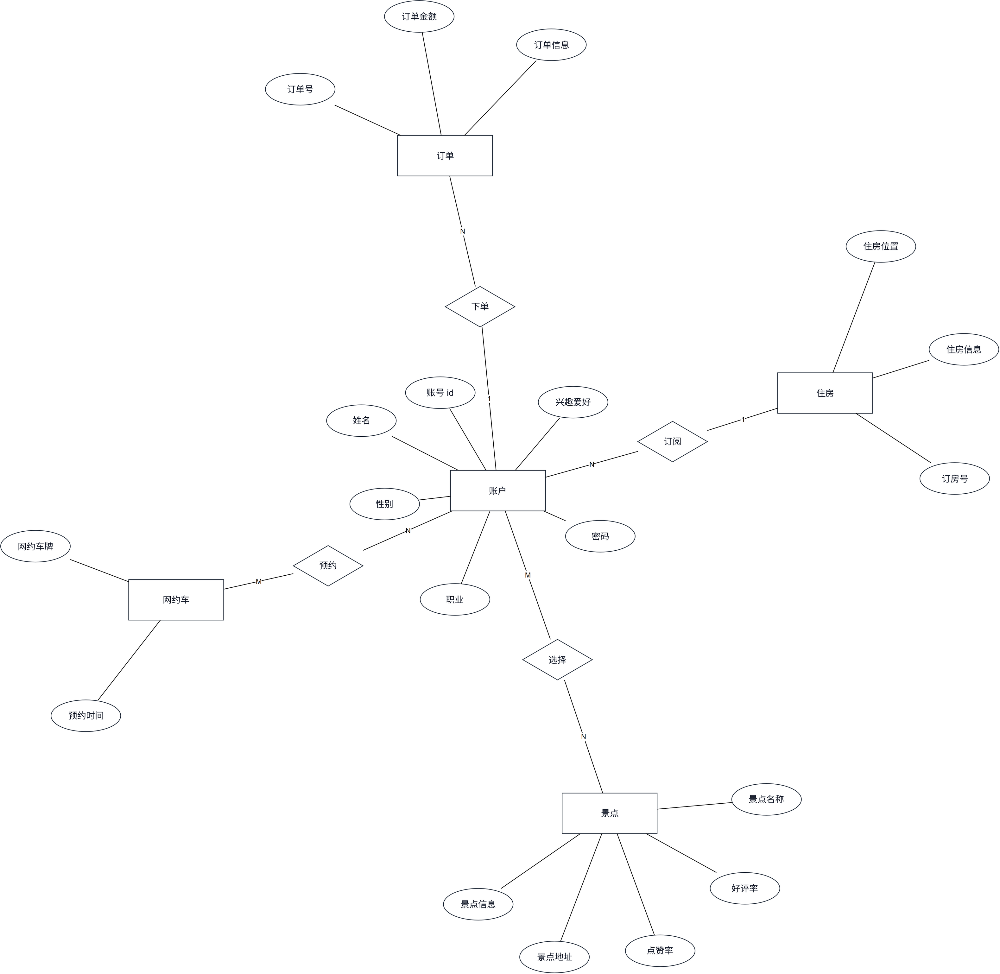

# AI → Diagram Model → ELK.js → Draw.io

AI 负责把自然语言、文档或图片转换成 Diagram Model；ELK.js 负责布局和路由，验证器检查几何质量与渲染诚实性，最后输出可编辑的 diagrams.net/Draw.io XML 和 SVG 预览。需要 Node.js 22.13+。

<p align="center">
  
  
  <br>
  
</p>

## 三分钟上手

```bash
npm install && npm run build   # 装好并编译（Node.js 22.13+）
npm test                       # 180 个测试应全绿
npm run examples               # 生成 19 张示例图到 examples/
npm run generate -- --preset layered --out output/first   # 不需要任何模型，一条命令出一张架构图
```

`npm run examples` 覆盖基础类型、扩展 UML、状态机、Chen ER 和 4 个架构预设（`examples/01-system-architecture` 至 `19-chen-er`），每个目录含 `.model.json`（结构 + 稳定 ID）、`.drawio`（可编辑的正式产物）和 `.svg`（快速预览）。示例模型自带 `"layout": { "profile": "strict" }`——按最严档校验与重排，是各图类型的质量门面。想写到独立目录对比，用 `npm run examples -- --out <directory>`。

想试「一句话出图」的完整闭环：`npm run demo`（设了 `DIAGRAM_ADAPTER_API_KEY` 走 OpenAI 兼容模型，没设走离线 mock，不需要任何 key）。业务图批量脚本：`npm run generate:toolshare`，结果全部写入 `output/drawio-tool/`。各入口的分工见下一节表格。

## 先说清楚：谁负责"理解"

**这里的「AI」不是本工具。** 项目刻意不调用任何模型、不存 API key——理解由宿主 agent（或它调用的 reasoner）承担，工具负责把结构画成诚实、可编辑的图。

| 你想要的 | 走哪条路 | 需要模型吗 |
|---|---|---|
| 说一句自然语言出图、丢一张图让它看懂并复述 | 宿主 agent 产出 Diagram Model：`--emit-plan` → 你的模型作答 → `--plan`（MCP：`diagram_plan_request` / `diagram_plan_submit`） | 需要，由调用方提供 |
| 一条命令跑通上面整个闭环 | `npm run demo`（`examples/adapter/` 下的 reference adapter：设了 `DIAGRAM_ADAPTER_API_KEY` 走 OpenAI 兼容模型，没设走离线 mock） | 需要，或用离线 mock 不需要 |
| 固定格式快速出图 | `--chain`：只吃 `类型：A -> B -> C` 箭头链与 Chen-ER 三段式；普通中文句子会以 `DIAGRAM_REQUEST_UNPARSED` 拒绝 | 不需要 |
| 已有模型重画、增量改、批量样例 | `--input <model.json>`、`--input --patch <patch.json>`、`--preset`、`--examples` | 不需要 |

**SVG 预览与 `.drawio` 出自同一份布局，主要形状一致**——圆柱、UML 组件（带卡榫）、部署立方体、Actor 火柴人、菱形、双圈终止态、弱实体双框在两边画的是同一个东西；文字在异形内部的精确落位仍可能有像素级出入，可编辑的 `.drawio` 才是真相；要看准就走本机 Draw.io 的位图（`--emit-review`）。

## 语义由调用方提供

本项目**不请求任何模型，也不保存 API key**。自然语言、文档和图片仍是入口，但「理解需求、产出 Diagram Model」这一步交给调用方——宿主 agent，或它调用的任意模型。项目负责把收到的答案逐个过闸门，再交给 ELK 布局。

流程：`--emit-plan` 先取一份规划任务（源材料 + 契约 + 答案格式），此步不产出图；用任意模型回答后存成 `answer.json`；再 `--plan answer.json` 回灌。注意 `--plan` 需要原始源材料（`--text` / `--document` / `--image`）来逐字核验证据，所以它和 `--emit-plan` 接收同一组输入参数。

**`npm run demo` 把这三步串成一条命令**，见 `examples/adapter/README.md`。adapter 是核心之外的零依赖参考实现：设了 `DIAGRAM_ADAPTER_API_KEY` 就走 OpenAI 兼容模型（`DIAGRAM_ADAPTER_BASE_URL` / `DIAGRAM_ADAPTER_MODEL` 可换服务与模型），没设就走确定性离线 mock——mock 只证明链路是通的，它会如实说自己是 mock。

默认档 `ai-led` 下，提交的答案只被"画得诚实"这一类闸门拦下：图类型与字段合法、稳定 ID 未被改写、不含任何 `x`/`y`/`width`/`height`/边路由（`MODEL_GEOMETRY_FORBIDDEN`）、关系类型是渲染器支持的、引用不悬空。证据 `quote` 是否逐字存在、置信度是否到 0.7、记法是否合该图类型的规范，都只作为 INFO 报告，不阻断（见「谁来评判」）。需要旧行为时，在模型里写 `"layout": { "profile": "strict" }`，闸门会重新要求逐字证据与不低于 0.7 的置信度。可选 `--audit audit.json` 提交对该答案的独立复审；不提供时质量报告会记 `SEMANTIC_AUDIT_SKIPPED` 警告并把 `auditConfidence` 留为 0，不会当成已通过审查。未通过闸门时不落盘。

文档支持 `.md`、`.txt`、`.pdf`、`.docx`；图片支持 PNG、JPEG、WebP（以 data URL 放进任务里，交给有视觉能力的调用方）。扫描版 PDF 没有可提取正文时会拒绝，请提供图片或可搜索 PDF。输入上限为 10 MB，提取文本上限为 60,000 字符。

产物包含 `.model.json`、`.drawio`、`.svg`、`.quality.json`。质量报告记录来源、逐字核验通过的证据条数、布局迭代次数和剩余问题；不代表调用方已证明文档的所有要求都被覆盖。

完全不需要模型的入口照常可用：`--chain`（箭头链与 Chen-ER 三段式解析）、`--preset layered|microservices|event-driven|cloud`、`--input <model.json>`（按当前布局参数重绘）、`--input <model.json> --patch <patch.json>`（稳定 ID 增量修改）、`--examples`。

箭头链解析（`--chain`，只认固定格式，不是自然语言）：

```bash
npm run generate -- --chain "用户 → 服务 → 数据库"
```

架构预设和已有模型重绘：

```bash
npm run generate -- --preset layered --title "毕业设计总体架构"
npm run generate -- --preset microservices
npm run generate -- --preset event-driven
npm run generate -- --preset cloud
npm run generate -- --input examples/01-system-architecture/system-architecture.model.json --out output/rebuilt
```

### 校验、布局和渲染命令

对已有 `.model.json` 可以分别执行流水线阶段。模型加载时会检查图类型、节点/边引用、容器引用和端口归属；`validate` 会执行 ELK 布局并输出结构化校验报告，发现 `ERROR` 时返回非零退出码。

模型边界还会拒绝不一致的嵌套容器关系（`parentId`、`containerIds`、层级循环和节点多重归属）以及不安全或越界的样式值。大图概览会通过 `metadata.overviewOf` 标记为派生视图，避免把子系统概览误报为原图类型的专用语义错误；几何校验会把边界接触和共线重叠也视为穿越/交叉问题。

专用元数据中的 State 复合状态节点、Activity 对象流边、ER/Chen ER 节点引用也会被检查。缺失引用会进入报告的 `issues`，严重度为 `ERROR`；`validate` 因此返回非零退出码。泳道与复合状态 ID 也参与稳定 ID 唯一性检查。自定义 `style.shape` 只接受已支持的形状与修饰项。

```bash
npm run generate -- validate examples/01-system-architecture/system-architecture.model.json --report output/validation.json
npm run generate -- layout examples/01-system-architecture/system-architecture.model.json --out output/layout
npm run generate -- render examples/01-system-architecture/system-architecture.model.json --out output/rendered
npm run generate -- help
```

`layout` 会生成 `<id>.layout.json`，`render` 会生成 `.model.json`、`.drawio` 和 `.svg`。报告包含 `valid`、兼容旧脚本的 `warnings`，以及带 `severity`、`code`、`phase`、`elementId` 和可选 `path` 的结构化 `issues`。`phase` 用 `semantic`、`layout`、`render` 区分问题来源，调用方不需要再解析 warning 文本。

布局结果还会记录 `status`（`passed`、`passed_with_warnings`、`failed_after_max_iterations`、`failed_composition_needed`）和 `iterationHistory`。重排**只拧对问题真有影响的旋钮**：加大间距实测能清掉节点重叠、过度密集、画布溢出和边穿节点，因此这几种情况才继续迭代；`EDGE_CROSSING`、`EDGE_UNROUTED`、`NODE_OUTSIDE_CONTAINER` 实测加大间距毫无变化（真实 11 节点模型上 x1→x4 交叉数恒为 1，画幅却从 1839×511 撑到 3243×871；`radial` 下这些参数根本不进引擎），所以回路**立刻停下**并把问题交回构图层，报 `RELAYOUT_NOT_FIXABLE_BY_PREFERENCES`，`status` 为 `failed_composition_needed`，提示改的是**结构**（去掉/改接跨层长边、容器分组、`constraints.placement` 定层、拆分）——注意 `direction`、节点次序和 layered 的交叉/排序类选项都实测无效，提示里不会拿它们骗你。作者显式写 `layout.relayoutTriggers` 时按作者要求跑满预算，不被这套判断拦下。语义错误同样不触发无意义重排。`render` 会在写文件前检查 Draw.io XML/SVG 的根结构、标签闭合、稳定节点/边 ID 和 SVG `viewBox`，检查失败时严格渲染命令返回非零退出码。

也可以用稳定 ID 对现有模型做增量更新。补丁只修改指定节点/边，未涉及的 ID 保持不变：

```bash
npm run generate -- --input examples/01-system-architecture/system-architecture.model.json --patch examples/patch-add-redis.json --out output/with-redis
```

补丁格式示例：

```json
{
  "addNodes": [{ "id": "node.redis", "label": "Redis", "kind": "cache" }],
  "addEdges": [{ "id": "edge.service-redis", "source": "node.service", "target": "node.redis", "type": "flow" }],
  "updateNodes": [{ "id": "node.service", "label": "Catalog Service" }]
}
```

可用操作包括 `addNodes`、`updateNodes`、`removeNodeIds`、`addEdges`、`updateEdges`、`removeEdgeIds`、`addContainers`、`updateContainers` 和 `removeContainerIds`。补丁在 Diagram Model 层应用，之后仍会完整执行 ELK 布局、几何验证、Draw.io 和 SVG 渲染。

所有运行时通用模板文字均为英文；只有用户输入、业务模型本身含中文时，节点和说明才会显示中文。

## 谁来评判：ai-led 与 strict

默认档位是 **`ai-led`**：图的结构和记法归作者（人或模型）决定，工具**不评判画得对不对题**，只保证**画出来的东西可信**。因此下面两类问题被降为 `INFO`——仍然出现在报告里，但不阻断交付、也不再触发自动重排：

- 按图类型的记法提示：缺 Actor、缺初始/终止伪状态、ER/Chen 关系类型不合常规、缺里程碑等（`src/validate/semantics.ts`、`src/validate/uml-rules.ts` 的 WARNING）；
- 观感与证据类：过密/过疏、超长边、孤立节点、标签压字、重复关系、同层约束未满足，以及 provenance 缺失、引文对不上原文、置信度偏低、模型自报的 blocking 不确定。

两个档位都仍然阻断的，是"工具自己失职"的那部分：断引用与重复 ID、悬空端口、节点落在容器外、未知形状名、**边没有被路由**、文字超出节点、画布溢出，以及这个工具的核心承诺——**节点重叠、连线穿框、连线交叉**。

关于"边没有被路由"：`layout.algorithm` 选 `stress` / `radial` 时 ELK 偶尔不给某几条边任何路径。这类边由 `vendor/libavoid/` 的**替补连线器**补画——只补 ELK 漏掉的，绝不重画 ELK 已经画好的，并在质量报告里写 `EDGE_ROUTED_BY_FALLBACK` 说明这几条不是 ELK 画的；连替补也补不出来才报 `EDGE_UNROUTED` 并阻断。**它没有接管全部连线**：10 张真实图对比实测是 ELK 更好 1 张、libavoid 更好 0 张、持平 9 张（那张不平的图上它把 1 处交叉变成 3 处）。出处、许可证与理由记在 `vendor/libavoid/NOTES.md`。

要回到旧行为，在模型里写 `"layout": { "profile": "strict" }`。档位随模型传递，CLI、MCP 与 plan 提交走同一入口，无需命令行参数。

## 视觉复核门禁

数值验证只能算出重叠和穿线，看不出「渲染出来到底能不能读」。文字截断、标签压线、图例遮挡这类问题只有看图能发现，所以这里加了一道**审查门禁**——同样由调用方承担模型部分。

```bash
# 1. 出审查包：位图 + 可引用元素 ID 白名单 + 几何事实 + 答案契约
npm run generate -- --emit-review output/review.json --input output/my-diagram/my-diagram.model.json --out output/review

# 2. 调用方看 output/review/*.png，按契约写 findings.json（只允许提布局偏好）

# 3. 回灌结论：只映射为 LayoutPreferences 并重跑 ELK
npm run generate -- --plan output/answer.json --review-findings output/findings.json --out output/reviewed
```

审查者只能当审查者：可用字段仅 `density`、`nodeSpacing`、`layerSpacing`、`containerPadding`、`targetAspectRatio`、`wrapping`、`edgeLabelFontSize`、`edgeLength`。它返回的**任何坐标、尺寸、边路由、Draw.io XML 都会在代码层丢弃并记为 WARNING**；不在 ID 白名单内的引用被降级为 `general`；无法映射到布局偏好的发现只记 `VISUAL_SEMANTIC_REQUIRED` 警告说明需要语义层修改，**不会伪造"已修复"**。补救始终回到 `layoutDiagram()` 重跑 ELK，坐标的唯一权威是 ELK（见 `AGENTS.md` 第 2、3 节）。

位图优先走真实 Draw.io 渲染（调用已安装的 draw.io Desktop，参数数组形式、默认 60 秒超时；Windows 下除环境变量外还会探测 `C:\Program Files\draw.io\draw.io.exe` 等标准位置），探测不到才退回 sharp 光栅化 SVG，结果里会写明实际用了哪个后端。`runVisualGate()` 仍保留了带审查轮次上限的自动回路（默认 2 轮，`visual_failed_after_max_rounds` 时照常出图并报 WARNING，不放宽标准），供宿主注入自己的 reviewer 实现使用。

审查者报告「没发现问题」不等于没问题——这一语义与证据审计一致，已写进结果的 `disclaimer`。

## 作为 MCP 服务被调用

`npm run mcp` 启动一个 stdio MCP 服务（零新增依赖），`npm run mcp:http` 用同一个分发器开 Streamable HTTP 端点——让任何支持 MCP 的 agent 宿主把本流水线当工具调用，而不是自己去拼 Draw.io XML。八个工具按方向分两类——**送出去的只有结构和任务，收回来的必须过闸门**：

| 工具 | 作用 |
|---|---|
| `diagram_plan_request` | 把文本/文档/图片打包成规划任务交给调用方的模型（本项目不发请求） |
| `diagram_plan_submit` | 回灌答案：逐个过证据、稳定 ID、UML 语义、坐标拒收，然后 ELK 布局落盘 |
| `diagram_review_request` | 渲染位图并返回可引用 ID 白名单 + 几何事实 + 答案契约 |
| `diagram_review_submit` | 回灌审查结论：只映射为 `LayoutPreferences` 并重跑 ELK，坐标一律丢弃 |
| `diagram_generate` | 仅箭头链解析（必须 `chain: true`），不调用任何模型 |
| `diagram_validate` | 布局 + 语义/几何校验，只返回报告，不写文件 |
| `diagram_render` | 布局 + 校验 + 写 `.model.json` / `.drawio` / `.svg` |
| `diagram_patch` | 按稳定 ID 增量修改已有模型后重跑全流程 |

调用方**不能**传入坐标：任何带 `x`、`y`、`sections`、`bendPoints`、`waypoints`、`geometry`、`mxCell`、`mxGeometry` 的 `model` 或 `patch` 会被 `INPUT_GEOMETRY_FORBIDDEN` 拒收，错误信息会说明坐标只能由 ELK 计算。路径参数被限制在服务根目录内（`DIAGRAM_MCP_ROOT`，默认启动时工作目录），越界返回 `PATH_OUTSIDE_WORKSPACE`。想要自然语言/文档/图片而又不提交计划答案时，`diagram_generate` 返回 `AGENT_PLAN_REQUIRED`，提示改走 `diagram_plan_request` → 自己的模型 → `diagram_plan_submit`，或显式设 `chain: true`。

### 接入任意 MCP 宿主（stdio）

先 `npm run build`，然后把编译产物注册成 stdio 服务——Claude Desktop、MiMo Desktop、Cursor 等任何支持 MCP 的宿主都吃这一种配置（改完需重启宿主并新建会话）：

```jsonc
{
  "mcpServers": {
    "ai-diagram-tool": {
      "command": "node",
      "args": ["<本仓库路径>/dist/src/mcp/server.js"],
      "env": { "DIAGRAM_MCP_ROOT": "<本仓库路径>" }
    }
  }
}
```

`DIAGRAM_MCP_ROOT` 指向项目目录，服务的读写都被限制在里面。开发时想跳过构建，也可以用 `node --import tsx src/mcp/server.ts`；注意 `--import tsx` 按**进程工作目录**解析 `tsx` 包，宿主必须把工作目录设成本项目根目录，否则起不来。两种方式都已在 Node v24 下实测握手成功（`initialize` 返回 `serverInfo.name = diagram-mcp`）。

### 或者走 HTTP：`npm run mcp:http`

同一套工具分发器开一个 **Streamable HTTP** 端点（MCP 2025-06-18）：`http://127.0.0.1:3000/mcp`，远程 agent、Web 宿主、跨机器进程都能调用。无会话模式：每次 POST 携带一条 JSON-RPC 消息——通知回 202、请求回单个 JSON；不提供服务端推送（GET 回 405）、无可终止会话（DELETE 回 405）；批处理在 2025-06-18 已被移除，POST 数组回 400；`MCP-Protocol-Version` 头不支持时回 400；请求体上限 10 MB。

安全按规范三条全做：每个连接校验 `Origin` 头（防 DNS 重绑定）、默认只绑 `127.0.0.1`、另校验 `Host` 头。环境变量：`DIAGRAM_MCP_HTTP_PORT`（默认 3000）、`DIAGRAM_MCP_HTTP_HOST`（默认 127.0.0.1）、`DIAGRAM_MCP_HTTP_ORIGIN`（逗号分隔的额外信任来源）。要暴露给其他机器，把 `DIAGRAM_MCP_HTTP_HOST=0.0.0.0` 的同时**必须**设置 `DIAGRAM_MCP_HTTP_ORIGIN`——只放行你信任的来源；两者都没配就想上公网，服务行为不会帮你兜底。

## 这些类型分别适合什么

- `system-architecture`：展示用户、前端、网关、服务、缓存、数据库、第三方系统之间的部署/调用关系。
- `uml-class`：展示类、属性、方法和继承、聚合、组合、依赖等静态结构。
- `uml-component`：展示组件、接口、依赖和系统边界，适合模块级设计。
- `uml-usecase`：展示 Actor、椭圆用例、系统边界，以及 association/include/extend 关系；不能用系统架构图代替。
- `flowchart`：展示业务步骤、判断分支、状态流转和处理流程。
- `er`：展示数据表、主外键和实体关系。
- `chen-er`：使用 Chen（陈氏）记法展示实体、属性、联系和 `1/N/M` 基数。
- `sequence`：时序消息和参与者。
- `state`：状态和状态转换。
- `state-machine`：UML 状态机，支持初始/终止伪状态、entry/do/exit 行为、guard/action 迁移和复合状态。
- `activity`：活动节点、分支和处理流。
- `deployment`：设备、节点和部署制品。
- `mindmap`：中心主题、分支和层级。
- `timeline`：时间点、阶段和里程碑。
- `network`：网络节点、链路和拓扑。

`src/diagram-types/registry.ts` 中的 `inferDiagramType` 会根据中文/英文关键词自动判断类型。UML 类图支持 association、dependency、inheritance、realization、aggregation、composition 等关系，并映射到对应的 Draw.io 箭头/虚线/菱形语义。系统架构请求还会进一步识别 layered、microservices、event-driven 和 cloud 模式，不会退化成流程图。

### 如何让它画其他图

AI 自然语言入口可以直接描述图类型和元素，例如：

```bash
npm run generate -- "画一个 UML 用例图：普通用户可以登录、浏览工具、提交租借申请"
npm run generate -- "画一个 UML 类图：User 继承 Account，Order 组合 OrderItem"
npm run generate -- "画一个组件图：Web、API Gateway、Catalog Service、MySQL"
npm run generate -- "画一个流程图：提交订单后判断库存，库存不足则结束"
npm run generate -- "画一个 ER 图：User、Tool、Order，User 和 Order 一对多"
npm run generate -- "画一个 Chen ER 图：账户、订单和下单联系，包含属性和 1/N 基数"
npm run generate -- "画一个 Sequence Diagram：Client 调用 Service 再访问 Database"
npm run generate -- "画一个 State Diagram：Pending 经过 approve 变成 Active"
npm run generate -- "画一个状态机图：订单从待审核进入租借中，超时后进入已逾期"
npm run generate -- "画一个 Deployment Diagram：Client、Application Server、Database Server"
```

### Chen ER 自然语言格式

`chen-er` 的 `--chain` 模式提供可预测的半结构化中文解析。建议使用“实体 / 某实体属性 / 联系”三个部分：

```bash
npm run generate -- --chain "画一个 Chen ER 图。实体：学生、课程；学生属性：学号（主键）、姓名；课程属性：课程号（主键）、课程名；联系：学生通过‘选修’联系课程，基数 M:N"
```

解析器会自动建立矩形实体、椭圆属性、菱形联系、无箭头关联线和 `1/M/N` 基数，并生成稳定 ID。属性可用 `（主键）`、`（多值）`、`（派生）` 标注；主键在 Draw.io/SVG 中以下划线显示，多值属性使用双椭圆，派生属性使用虚线椭圆。如果联系未写基数，工具保留联系但输出 `cardinality is unspecified` 警告，不会自行猜测。

`--chain` 模式下，复杂业务建议把每组定义用换行或中文分号隔开。无法可靠理解的自由文本会直接拒绝生成并返回 `DIAGRAM_REQUEST_UNPARSED`，避免把无关的内置示例误当成业务语义。仅指定图类型而未提供节点、关系或该类型专用字段时也会拒绝生成；内置图只通过 `npm run examples` 或明确的 `--preset` 选项生成。需要可控结果时建议直接编辑/生成 `.model.json`。

复杂图或后续修改建议直接编辑/生成 `.model.json`：模型只描述节点、关系、容器和语义，不写最终坐标；随后统一经过 `layoutDiagram`、`validateLayout` 和两个渲染器输出。使用 `--input` 可以直接重绘修改后的模型。

## 扩展架构

图类型由 `src/diagram-types/registry.ts` 注册。每个类型提供别名、默认方向和示例工厂；新增类型不需要修改 CLI 或布局主流程，只需在 `DiagramType` 增加名称、实现解析器或模型工厂、注册 aliases，并补充专用渲染与验证语义。Sequence、State、Activity、Deployment、Mind Map、Timeline、Network Graph 不会被自动转换成 Flowchart，也不会在自然语言内容不足时偷偷套用示例模板；扩展工厂只用于内置示例和显式预设。

核心运行时代码不注入固定中文文本。节点标题、边标签和描述都来自 Diagram Model：中文请求可以产生中文业务标签，英文请求使用英文标签；通用模板默认使用英文。

## 高级 UML 支持

中间模型已为高级 UML 语义提供专用字段，避免把它们降级成普通边标签：

- Sequence：`sequence.activations`、`sequence.fragments`，支持 activation bar、`alt/opt/loop/par` 片段、guard 和 return message。
- Sequence 消息按从上到下的出现顺序自动显示 `1.`、`2.`、`3.` 序号，增删消息后自动重新编号。
- Activity：`activity.swimlanes`、`activity.objectFlows`，支持泳道和对象流关系。
- State：`state.composites`，边支持 `guard` 与 `action`，并区分初始/终止状态。
- Deployment：`deployment.artifacts`，节点支持 device/server/database，边支持 communication path。

### 数据库字段的主外键记号

`classMeta.attributes[].key` 支持 `PK` / `FK` / `UK`，渲染成 `«PK»user_id: BIGINT`。三条约束：

- 标记文字由**同一个函数**产出（`utils/text.ts` 的 `keyMarker`），宽度测量与两个渲染器共用它，所以盒子不会按没有标记的尺寸算、再让标记溢出；
- `.drawio` 与 `.svg` 输出**逐字相同**的标记文本；
- 填了 `PK/FK/UK` 之外的值会在 `createDiagram` 直接抛错，不会安静地画出 `«BOGUS»`。

节点上的 `style.dashed` 现在两个渲染器都兑现（`.drawio` 加 `dashed=1`，SVG 给轮廓加 `stroke-dasharray`，文字保持实线）——此前它被两边同时忽略，写了等于没写。

### 一整套 ER 图（总图 + 每表一张子图）

`npx tsx scripts/generate-er-suite.ts [输出目录]` 会生成概念总图、表关系总图、以及每张表一张陈氏局部图（焦点表实线、相邻表虚线、属性椭圆带主键下划线）。每张图**先布局先校验再落盘**，任何一张不干净都会在输出里报出错误数，而不是悄悄交出去。
- UML Class：`classMeta` 支持 stereotype、泛化参数、属性、方法、可见性、类型、参数、静态/抽象标志；边支持 source/target multiplicity。
- ER：`er.entities` 支持 weak entity、identifying relationship；foreign-key 边支持 `1`、`0..*`、`1..*` 等基数。
- Chen ER：`chenEr.entityIds`、`chenEr.attributeIds`、`chenEr.relationshipIds` 分别标记实体、属性和联系节点；节点使用矩形、椭圆和菱形，连接使用无箭头 association 边。

这些字段会进入 Draw.io 主文件；布局仍由 ELK 计算，验证器会检查引用完整性和图类型约束。对于正式论文，建议先在 `.model.json` 中明确语义，再生成 `.drawio`，不要直接手改 XML。

## 专业绘图约束

生成前先确定 Diagram Type，再建立该类型允许的节点和关系；布局坐标永远由 ELK 计算。渲染器不会把不同语义的关系偷偷改成普通箭头：例如类图继承使用空心三角、组合使用实心菱形、用例关联使用无箭头实线、依赖/包含使用虚线开放箭头。布局后会检查重叠、穿线、交叉、孤立节点、边界溢出和类型语义；有问题时自动增加间距并重新布局，仍有问题会输出 Layout Warning。

### Container、Port 与局部布局

- Container 是 ELK compound node，参与布局计算，不是渲染阶段后补的背景框。
- Container 支持 `parentId` / `containerIds` 嵌套，并可分别设置 `direction`、`padding`、`spacing`。
- Node 的 Port 会以 `FIXED_SIDE` 送入 ELK；Edge 使用 `sourcePort` / `targetPort` 精确连接节点边缘。
- 长文本、类属性和方法会按字符宽度测量；显式尺寸过小也会自动扩张，默认不会压缩进固定画布。
- 布局默认使用 `balanced` 密度；流程图和状态机图采用更紧凑的专用 profile，让主路径占据画布中心，同时保留节点边缘和标签的安全间距。可通过 `layout.density`、`layout.nodeSpacing`、`layout.layerSpacing`、`layout.targetAspectRatio` 和 `layout.wrapping` 覆盖。

例如需要更紧凑的业务流程，可在 `.model.json` 中加入：

```json
{
  "layout": {
    "density": "compact",
    "nodeSpacing": 30,
    "layerSpacing": 28,
    "targetAspectRatio": 1.05,
    "wrapping": "OFF"
  }
}
```

这些参数只影响 ELK 布局，不会把坐标写回模型；`wrapping` 在 ELK 不适用时会自动安全回退为非包装布局，并保留 Layout Warning。
- `constraints.placement` 支持 `FIRST`、`LAST`、`FIRST_SEPARATE`、`LAST_SEPARATE`，**实测生效**（底层 `layering.layerConstraint`）。最上/最下用 TOP_TO_BOTTOM 配合 FIRST/LAST，最左/最右用 LEFT_TO_RIGHT 配合 FIRST/LAST。
- `constraints.forceSingle=true` 让超过 40 节点的图仍然只出一张，不拆分子系统。

**`constraints.sameLayer` 和 `constraints.before` 已从模型 API 删除**（破坏性变更）。它们此前是「读起来像承诺的死配置」：`sameLayer` 映射到 `layering.layerChoiceConstraint`，`before` 改变送入引擎的子节点次序，而在 elkjs 0.12.0 上两者都**没有任何可观察效果**——连「x、y 本来就在同一层」这种最廉价的可满足用例都不动。现在带着这两个键的 `.model.json` 会在 `createDiagram` 直接抛错，错误信息说明为什么被删、以及该改用哪个杠杆，而不是安静地按作者没要求的方式布局。

想消交叉请改**结构**：去掉或改接跨层长边、用容器分组、用 `placement` 定层、或拆分。`direction` 翻转、`layout.algorithm` 切换、改节点次序都实测无效，工具的建议文案里也不会拿它们骗你（有测试钉住这一点）。

示例：

```json
{
  "direction": "LEFT_TO_RIGHT",
  "constraints": {
    "placement": { "node.user": "FIRST", "node.database": "LAST" }
  }
}
```

### 架构图样式和图例

`theme.name` 支持 `professional`、`monochrome`、`blueprint`。`theme.showLegend=true` 会在图右侧生成可继续编辑的 Draw.io 图例；图例和 Deployment artifact 都会被计入页面边界。专业主题只区分少量稳定角色色：Service、Gateway、Cache、Queue、Database、External System，避免随机彩虹色。

## UML 质量保证

语义检查分两处，都用**稳定错误码**（完整码表与严重度见 `docs/ERROR_CODES.md`）：

- `src/validate/semantics.ts`：按图类型的结构性要求——缺 Actor、缺初始/终止伪状态、类图里混进 `flow`/`foreign-key` 边、State 复合状态与 Activity 对象流与 ER/Chen ER 的专用元数据引用悬空等。
- `src/validate/uml-rules.ts`：20 条 UML 规则，码以 `UML_` 开头，覆盖用例图（`include`/`extend` 端点、Actor 之间该用泛化、用例未被任何 Actor 使用）、类图（继承环、双向组合/聚合、自组合、`realization` 未指向接口）、时序图（消息/激活条/组合片段引用悬空、`create` 消息不是首条）、状态图（初始态唯一、初始态无入边、终止态无出边、不可达状态）、组件图（依赖环）。

这些码是手写常量，不是从提示语里生成的，所以改措辞不会改掉调用方依赖的码。默认 `ai-led` 档下它们是 `INFO`（不阻断、不触发重排），`strict` 档下是 `WARNING`；见「谁来评判：ai-led 与 strict」。

视觉记法：

- **类图**：静态成员下划线，抽象方法斜体，接口/抽象类名斜体。
- **时序图**：按 `messageKind`（`call` / `return` / `create` / `destroy` / `signal`）与 `isAsync` 区分箭头与虚线；`return` 与反向消息画虚线开放箭头，`destroy` 画叉。
- **状态图**：初始态是实心圆，终止态是 `doubleEllipse` 双圈（UML 2.5 的 14.2.3.4 记法）。
- **用例图**：Actor 泛化用空心三角箭头。

文档分工见 `docs/ROADMAP.md` 顶部。历史阶段报告在 `docs/archive/`，**不作为事实源**，其中失效的命令与数字逐条列在 `docs/archive/README.md`。

## 修改现有图

`.model.json` 是稳定 ID 的中间模型；读取它后修改 `nodes`、`edges` 或 `containers`，再调用 `layoutDiagram`、`renderDrawio` 和 `renderSvg` 即可增量更新。例如增加 Redis 只需加入 `node.redis` 与 `edge.service-redis`，原有 ID 和结构保持不变。对现有模型的精确修改也可以使用上面的 JSON patch 入口，避免重新生成导致原有节点 ID、Git diff 和人工编辑内容失去稳定性。

## 布局与扩展

`src/layout/elk.ts` 集中配置 ELK layered、方向、ORTHOGONAL 路由、节点/层间距，以及最多 5 次自动迭代（旋钮对某类问题无效时会提前停止并交回构图层，见「校验、布局和渲染命令」）。`src/validate/index.ts` 检查重叠、断边、孤立节点、边穿节点、画布溢出、重复 ID 与大图告警。新增图类型时：扩展 `DiagramType`，在 `src/diagram-types/` 添加构造器/语义规则，并在渲染器中补充必要样式。

布局算法是**按图选择**的构图杠杆，写在模型顶层 `layout.algorithm`，取值 `auto | layered | stress | mrtree | radial`（`LAYOUT_ALGORITHMS` 是唯一事实来源，CLI 与 MCP 共用）。留空 `auto` 即沿用图类型默认（mindmap→mrtree，network/chen-er→stress，其余→layered）；`mrtree` 适合树状分支，`stress` 适合力导向网络，`radial` 把 hub 放到中心做环形阅读。两个例外走**专用确定性布局**（AGENTS §6 预留）：`timeline` 在未显式指定算法时把里程碑排上一条共享轴线，`mindmap` 按子树高度把分支配平到根的两侧（ELK 的树布局只会往一边挂）；显式写了 `algorithm` 就仍用 ELK。已知边界：`radial` 与 Container 同时使用会让子节点落到框外（校验报 `NODE_OUTSIDE_CONTAINER`），在稠密图上还会让同环节点重叠，因此只作为显式选择、不进入任何默认路径。`box` / `rectpacking` 刻意不暴露——实测它们不为边生成任何路由段，交付出来是一堆没有连线路径的框。不在白名单内的算法名会直接抛错，不会被静默降级成 layered。

**直线不再被折成直角。** 一条边若在 ELK 里没有拐点，`.drawio` 会写 `edgeStyle=none`。不加这个覆盖，Draw.io 会拿端点自己重排成直角折线——于是同一个模型 `.drawio` 里是折线、`.svg` 里是直线，而校验器量的那条直线其实根本没被画出来。现在两个渲染口径一致：**校验的是什么线，看到的就是什么线**。带拐点的边仍保留 `<Array as="points">` 与正交路由。

若节点超过 40 个，CLI 会优先按照顶层 Container 自动生成 `main.drawio` 概览和各子系统 `.drawio`；没有 Container 时按稳定节点顺序拆成 `part-1`、`part-2`。每一份同时生成 `.model.json` 和 `.svg`，子图中的原节点/边 ID 不变。拆分时还会额外写一个 `<id>.multipage.drawio`：各部分按顺序合并为同一文件的多页，每页保留自己的 id、名称与画幅；审查位图时可用 `rasterizeForReview({ page })` 只导出某一页。用户明确要求单图时设置 `constraints.forceSingle=true`，仍会生成一张图并保留 Layout Warning。

## 目录与扩展点

- `src/model/`：与 Draw.io 无关的 Diagram Model、稳定 ID、模型读写和增量合并。
- `src/diagram-types/`：15 种可请求的图类型、UML 示例和架构预设。
- `src/layout/elk.ts`：ELK compound layout、端口、正交路由和最多 5 次质量迭代。
- `src/validate/`：UML 语义与几何质量检查。
- `src/render/`：可编辑 mxGraph XML 与 SVG 预览。
- `vendor/libavoid/`：替补连线器（drawio 编译的 libavoid，LGPL-2.1 + Apache-2.0），只在 ELK 漏画边时启用；出处、许可证与"为什么不当主连线器"的实测记录见该目录 `NOTES.md`。
- `src/pipeline/split.ts`：超过 40 节点的概览/子系统拆分。

增加 UML Sequence Diagram 的新特性时，模型字段在 `src/model/types.ts`，时序专用 Draw.io/SVG 渲染在 `src/render/drawio.ts` 与 `src/render/svg.ts` 的 `renderSequence*`，规则放入 `src/validate/uml-rules.ts`，示例放入 `src/diagram-types/extensions.ts`。新增全新图类型则还要在 `DiagramType` 和 `src/diagram-types/registry.ts` 注册。
