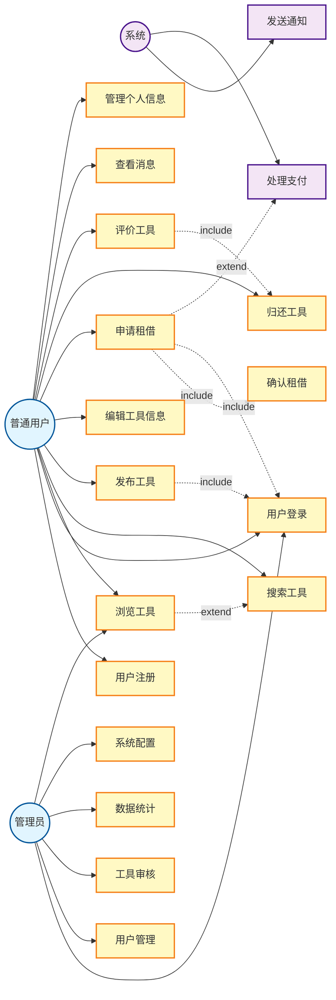

# 社区闲置工具共享租借平台 - 用例图

## 用例说明

### 普通用户用例
- **用户注册**: 新用户创建账号
- **用户登录**: 用户身份验证
- **浏览工具**: 查看平台上的工具列表
- **搜索工具**: 根据关键词、类别搜索工具
- **发布工具**: 用户发布闲置工具供他人租借
- **编辑工具信息**: 修改已发布工具的信息
- **申请租借**: 用户申请租借某个工具
- **确认租借**: 工具所有者确认租借请求
- **归还工具**: 租借结束后归还工具
- **评价工具**: 对租借过的工具进行评价
- **查看消息**: 查看系统通知和用户消息
- **管理个人信息**: 修改个人资料和设置

### 管理员用例
- **用户管理**: 管理平台用户，处理违规行为
- **工具审核**: 审核用户发布的工具信息
- **数据统计**: 查看平台运营数据和统计报表
- **系统配置**: 配置平台参数和规则

### 系统用例
- **发送通知**: 自动发送各类通知消息
- **处理支付**: 处理租借交易的支付流程

## 关系说明
- **实线箭头**: 参与者与用例的关联关系
- **虚线箭头 (include)**: 包含关系，基础用例必须执行
- **虚线箭头 (extend)**: 扩展关系，可选执行
